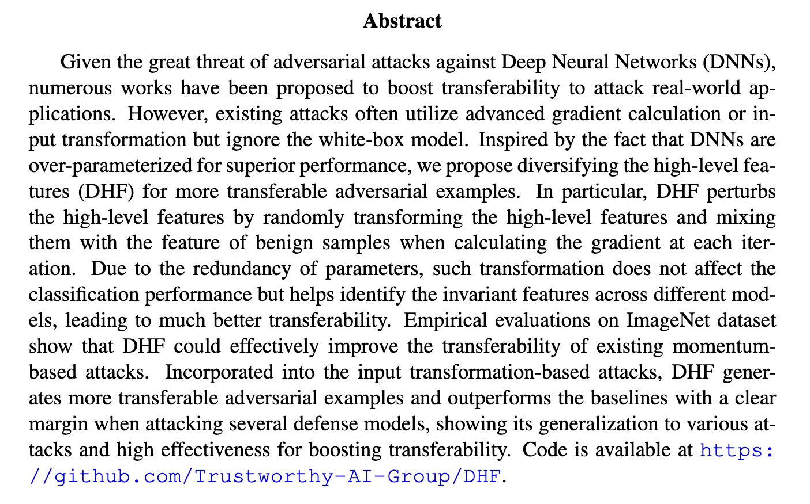

# Diversifying the High-level Features

This repository contains code implementing the idea of the paper:

[Diversifying the High-level Features for better Adversarial Transferability](https://arxiv.org/abs/2304.10136) (BMVC 2023)

Zhiyuan Wang, Zeliang Zhang, Siyuan Liang, Xiaosen Wang



> We also include the torch version code in the framework [TransferAttack](https://github.com/Trustworthy-AI-Group/TransferAttack).

## Requirements

+ Python >= 3.7
+ Tensorflow = 1.14.0
+ NumPy >= 1.21.6
+ SciPy >= 1.1.0
+ Pandas >= 1.0.1
+ imageio >= 2.9.0

## Qucik Start

### Prepare the data and models

Firstly, you should prepare your own benign images and the corresponding labels. The path for the input images and labels are set by ``--input_dir``. You can download the data [here](https://drive.google.com/drive/folders/1CfobY6i8BfqfWPHL31FKFDipNjqWwAhS). 

Next, you should prepare some pretrained models and place them in directory ``./models``. Some pretrained models can be downloaded [here](https://drive.google.com/drive/folders/10cFNVEhLpCatwECA6SPB-2g0q5zZyfaw) and [here](http://ml.cs.tsinghua.edu.cn/~shuyu/p-rgf/checkpoints/resnet_v2_152.ckpt).

### Runing attack

You could run DHF as follows:

```
python mi_fgsm.py --input_dir ./dev_data --method dhf --arch res_101
```

The generated adversarial examples would be stored in directory `./results` and the attack success rates will be reported.

# Citation

If you find the idea or code useful for your research, please consider citing our [paper](https://arxiv.org/abs/2304.10136):

```
@inproceedings{wang2023diversifying,
     title={{Diversifying the High-level Features for better Adversarial Transferability}},
     author={Zhiyuan Wang and Zeliang Zhang and Siyuan Liang and Xiaosen Wang},
     booktitle={Proceedings of the British Machine Vision Conference},
     year={2023},
}
```
